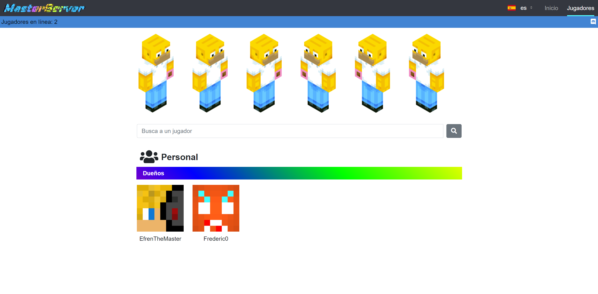

=======================
Diseño de la aplicación
=======================

| La función de la aplicación es mostrar estadísticas sobre los jugadores del servidor. Además está disponible en dos idiomas (Español e Inglés).

Vistas
======

-----
Común
-----

| El número de jugadores que están conectados en el servidor y el discord del servidor.

------
Inicio
------

| Muestra un slider con imágenes del servidor.

.. image:: media/home.png
   :width: 1000px

---------
Jugadores
---------

| Muestra la skin de los últimos 6 jugadores que han entrado en el servidor, además hay un input para buscar a los jugadores por su nombre y muestra los jugadores que pertenecen al staff del servidor.

.. image:: media/players.png
   :width: 1000px

--------------
Jugador actual
--------------

| Muestra estadísticas y características sobre el jugador que se ha buscado en el input de la anterior vista.

.. image:: media/player.png
   :width: 1000px

-------------------
Jugadores traducida
-------------------

| Ejemplo de una vista traducida.

